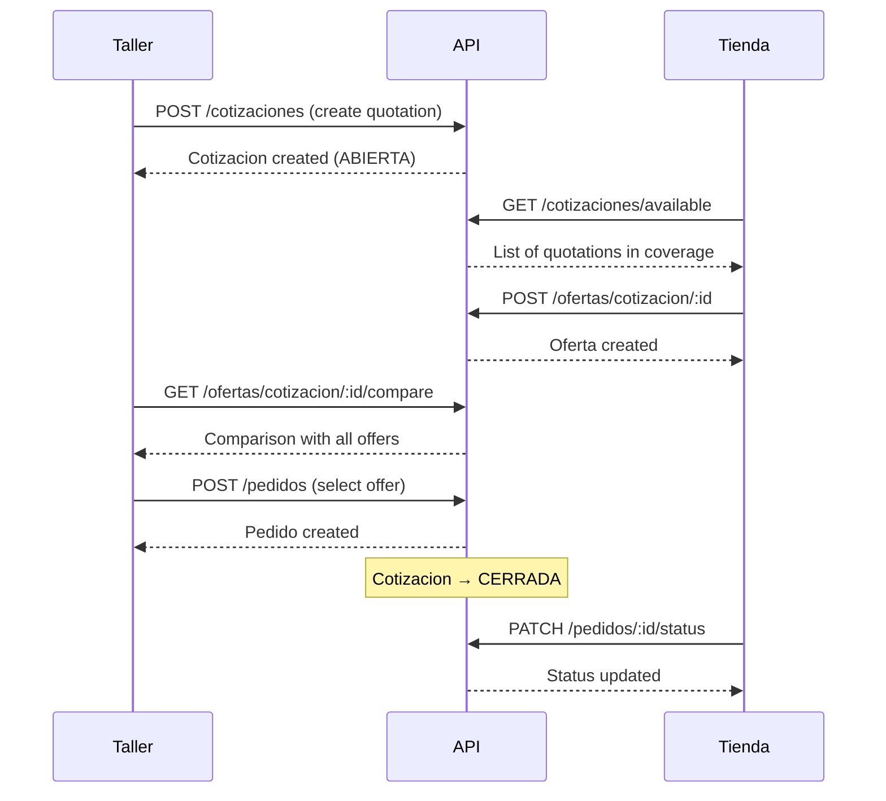

# Backend Implementation Summary

## 📊 Backend Status: ~85% Complete

All core business modules have been implemented with full CRUD operations, business logic validation, and role-based access control.

---

## ✅ Completed Modules

### 1. Authentication & Authorization
**Module**: `/backend/src/auth/`

**Endpoints**:
- `POST /api/auth/register` - User registration
- `POST /api/auth/login` - User login
- `POST /api/auth/refresh` - Refresh access token
- `GET /api/auth/me` - Get current user profile

**Features**:
- ✅ JWT with access + refresh tokens
- ✅ Bcrypt password hashing
- ✅ Role-Based Access Control (TALLER, TIENDA, ADMIN)
- ✅ Custom guards and decorators

---

### 2. Talleres (Workshops)
**Module**: `/backend/src/talleres/`

**Endpoints**:
- `POST /api/talleres` - Create workshop profile
- `GET /api/talleres` - Get all workshops (Admin)
- `GET /api/talleres/me` - Get own profile
- `GET /api/talleres/:id` - Get workshop by ID
- `PATCH /api/talleres/:id` - Update profile
- `DELETE /api/talleres/:id` - Delete profile

**Business Rules**:
- ✅ One profile per user
- ✅ RUT uniqueness validation
- ✅ Ownership verification for updates

---

### 3. Tiendas (Stores)
**Module**: `/backend/src/tiendas/`

**Endpoints**:
- `POST /api/tiendas` - Create store profile
- `GET /api/tiendas` - Get all stores
- `GET /api/tiendas/me` - Get own profile
- `GET /api/tiendas/:id` - Get store by ID
- `PATCH /api/tiendas/:id` - Update profile
- `DELETE /api/tiendas/:id` - Delete profile

**Features**:
- ✅ Geographic coverage configuration (cobertura array)
- ✅ RUT uniqueness validation
- ✅ Store catalog relationship

---

### 4. Repuestos (Parts Catalog)
**Module**: `/backend/src/repuestos/`

**Endpoints**:
- `POST /api/repuestos` - Create part (Store only)
- `GET /api/repuestos` - Get all parts
- `GET /api/repuestos/search` - Advanced search
- `GET /api/repuestos/:id` - Get part by ID
- `PATCH /api/repuestos/:id` - Update part
- `DELETE /api/repuestos/:id` - Delete part

**Search Features**:
- ✅ Full-text search (nombre, codigo, marca, descripcion)
- ✅ Filter by brand, category, store
- ✅ Stock availability filter
- ✅ Pagination & sorting
- ✅ Price range support

**Business Rules**:
- ✅ Unique part code per store
- ✅ Category tagging
- ✅ Stock management

---

### 5. Cotizaciones (Quotations)
**Module**: `/backend/src/cotizaciones/`

**Endpoints**:
- `POST /api/cotizaciones` - Create quotation (Taller)
- `GET /api/cotizaciones` - Get all quotations
- `GET /api/cotizaciones/available` - Available for store (coverage-based)
- `GET /api/cotizaciones/:id` - Get quotation details
- `PATCH /api/cotizaciones/:id` - Update quotation
- `POST /api/cotizaciones/:id/close` - Close quotation
- `DELETE /api/cotizaciones/:id` - Delete quotation

**Workflow**:
1. Taller creates quotation with multiple items
2. System publishes to stores in covered regions
3. Stores submit offers
4. Taller compares and selects winner
5. Quotation closes automatically on order creation

**Business Rules**:
- ✅ Status management (ABIERTA, CERRADA, CANCELADA)
- ✅ Geographic filtering for stores
- ✅ Prevents modification when closed
- ✅ Cannot delete with existing offers

---

### 6. Ofertas (Offers)
**Module**: `/backend/src/ofertas/`

**Endpoints**:
- `POST /api/ofertas/cotizacion/:id` - Submit offer (Store)
- `GET /api/ofertas/cotizacion/:id` - Get all offers for quotation
- `GET /api/ofertas/cotizacion/:id/compare` - Compare offers
- `GET /api/ofertas/:id` - Get offer details
- `DELETE /api/ofertas/:id` - Delete offer

**Comparison Logic**:
```javascript
{
  total: number,           // Total price
  diasEntrega: number,     // Delivery days
  itemsCubiertos: number,  // Items covered
  cobertura: number,       // Coverage percentage
  tienda: {...}
}
```

**Business Rules**:
- ✅ One offer per store per quotation
- ✅ Only for open quotations
- ✅ Auto-calculate totals
- ✅ Cannot delete with existing order
- ✅ Item availability tracking

---

### 7. Pedidos (Orders)
**Module**: `/backend/src/pedidos/`

**Endpoints**:
- `POST /api/pedidos` - Create order from offer (Taller)
- `GET /api/pedidos` - Get all orders (filtered by role)
- `GET /api/pedidos/:id` - Get order details
- `PATCH /api/pedidos/:id/status` - Update status (Store)
- `POST /api/pedidos/:id/cancel` - Cancel order

**Order Lifecycle**:
1. **PENDIENTE** → Created from selected offer
2. **CONFIRMADO** → Store confirms
3. **EN_PROCESO** → Being prepared
4. **ENVIADO** → Shipped
5. **ENTREGADO** → Delivered (auto-sets date)
6. **CANCELADO** → Cancelled

**Business Rules**:
- ✅ One order per quotation
- ✅ Auto-closes quotation on creation
- ✅ Auto-calculates total from offer items
- ✅ Estimated delivery date calculation
- ✅ Cannot cancel delivered orders
- ✅ Role-based access (Taller sees their orders, Store sees theirs)

---

## 📋 API Summary

| Module | Endpoints | CRUD | Search | Authorization |
|--------|-----------|------|--------|---------------|
| Auth | 4 | ✅ | - | Public + JWT |
| Talleres | 6 | ✅ | - | TALLER, ADMIN |
| Tiendas | 6 | ✅ | - | TIENDA, ADMIN |
| Repuestos | 6 | ✅ | ✅ | TIENDA, Public search |
| Cotizaciones | 7 | ✅ | ✅ | TALLER, TIENDA (filtered) |
| Ofertas | 5 | ✅ | ✅ | TIENDA, TALLER |
| Pedidos | 5 | ✅ | - | TALLER, TIENDA, ADMIN |

**Total Endpoints**: ~39

---

## 🔄 Complete Workflow Example



---

## 🔒 Security & Validation

All modules include:
- ✅ **Input validation** (class-validator)
- ✅ **JWT authentication** (except public endpoints)
- ✅ **Role-based authorization** (guards)
- ✅ **Ownership verification** (user can only modify their own resources)
- ✅ **Business rule validation** (status transitions, uniqueness constraints)

---

## 📝 Next Steps

### Pending Implementation

1. **Admin Module** (optional)
   - User management endpoints
   - Platform statistics
   - System monitoring

2. **Notifications Module**
   - BullMQ queue setup
   - Email notifications (SMTP)
   - Event-driven notifications

3. **Meilisearch Integration**
   - Index repuestos on creation/update
   - Advanced search implementation

---

## 🚀 Ready to Test

Once dependencies are installed, the backend will support the complete quotation workflow:

```bash
cd backend
npm install
npx prisma generate
npx prisma migrate dev --name init
npm run start:dev
```

Access Swagger docs at: `http://localhost:4000/api/docs`
